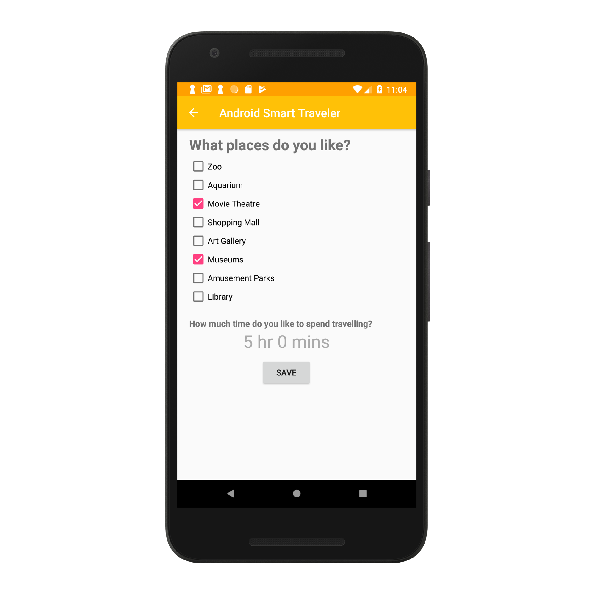

Android Smart Traveler 
===

The purpose of developing of this android application is to act as an assistant to a traveler travelling a city and aid him in exploring the city. 
The traveler fills in a questionnaire regarding the places he likes and how much time he is likely to spend in traveling. The application analyses the questionnaire and displays a list of recommendations according to his likes.
Firstly, the traveler registers himself by filling in his details and after successful registration, user can login now using login credentials. He is greeted by a menu screen that consists of an option for questionnaire, map and the list of recommendations for him.
The map shows him his current location where he can search any place in the world as well as look for nearby places of interests and restaurants near him as a pin on the map.
The recommendations list shows him a list of places around him according to his likes that he filled in the questionnaire. He has the option to filter the recommendations according to how much time it will take him to get there added an extra hour for spending at that place.
This application uses Google Places and Google Maps API to get the nearby places and the map.

Features
===

- This project has a login page which allows only the registered user to login and thereby preventing unauthorized access.

 
 
- This system can be used to view the location view in map that the user wishes to reach.

- Questionnaire to give insight to the user's interests.

- View general places of interests around your current location on map.

- Recommendations tailored to the user's interests filtered with time required to reach and approximate time spent at the place recommended.
